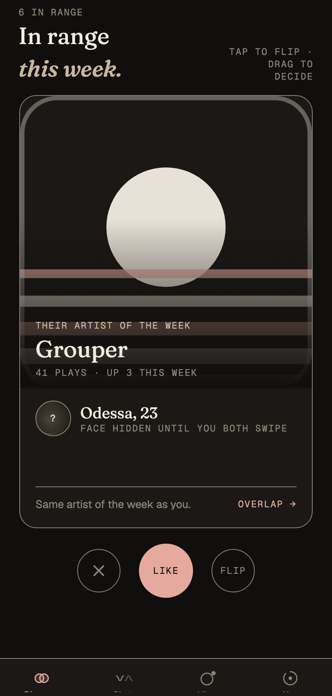
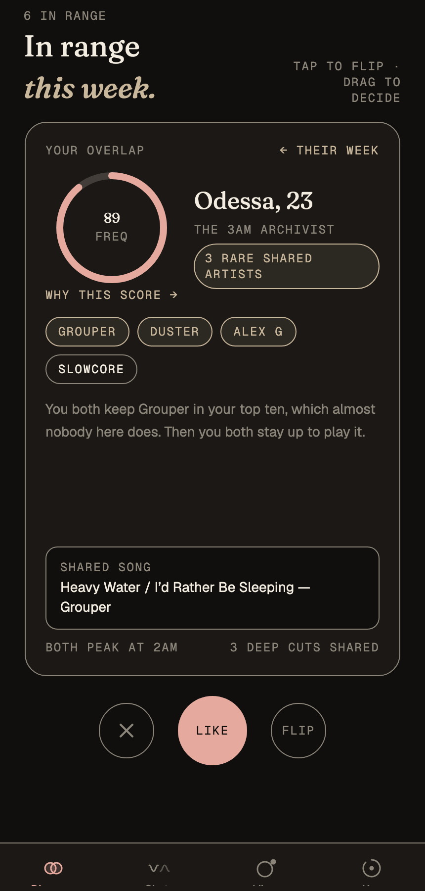
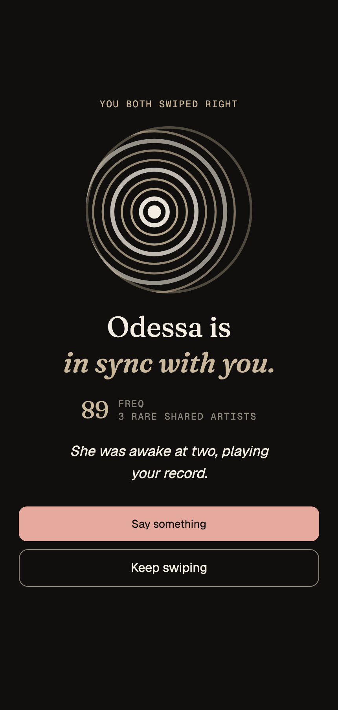
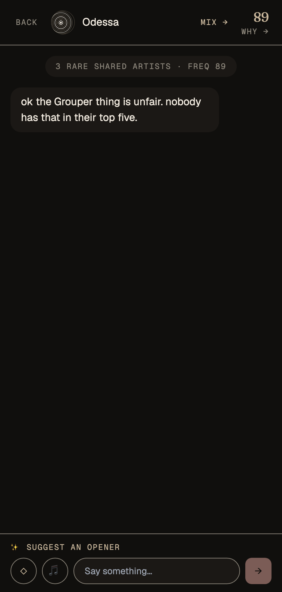
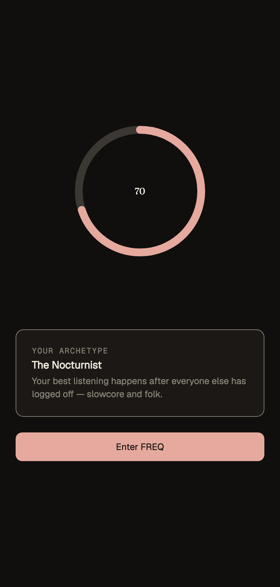
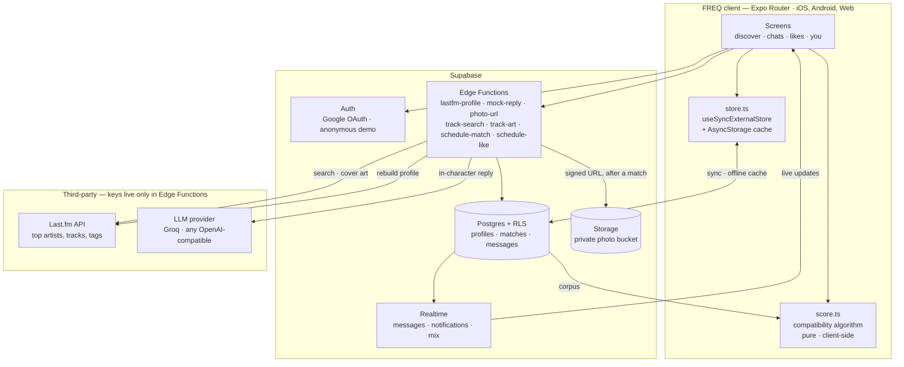

# FREQ

**A dating app where you discover people by what they actually play — not a photo, not a bio.**

FREQ reads your real listening history and scores compatibility against everyone
else on a rarity-weighted model: sharing a megastar is worth almost nothing,
sharing an artist with two hundred listeners is the entire signal. The mechanic
that makes it work is restraint — **faces stay sealed.** Before a mutual match you
get a name, their artist of the week, and your musical overlap; their avatar is a
procedurally generated album sleeve, blurred, with a "?". Only a mutual swipe
unseals the face. It's a bet that taste is a better first impression than a
selfie, and the whole product is built around defending that bet.

### → **[freq-sand.vercel.app](https://freq-sand.vercel.app)**

Hit **"Try the demo"** — anonymous sign-in, no account, no email. You get your own
throwaway profile, so your swipes never collide with anyone else's. Connect a real
Last.fm account to see the algorithm run on your own scrobbles, or **skip** and
explore on a sample profile.

---

## What it looks like

| Sealed deck | Your overlap | Mutual reveal | Thread |
|---|---|---|---|
|  |  |  |  |
| Their artist of the week. The face stays hidden. | Flip the card: score, shared artists, the reason. | Both swiped right — the sleeve unseals. | Realtime chat, in-thread games, a shared Mix. |

<p align="center">
  
</p>

---

## Architecture



**Scoring runs client-side and stays pure.** `score.ts` has no imports beyond
types — it takes a corpus and two profiles and returns a number plus a reason
list. That's what makes it unit-testable in plain Node, and why the algorithm is
the one part of this codebase with real test coverage.

**The secrets never reach the bundle.** The Last.fm and LLM keys live only in
Edge Function secrets. The client holds the Supabase anon key, which is public by
design and useless without row-level security behind it.

---

## Sealed until matched, enforced by the database

"Nobody sees your face before a mutual match" is the product's whole premise, so
it is enforced where it cannot be argued with rather than in the UI.

- Photos live in a **private Storage bucket** (`public => false`, 5MB cap, MIME
  allow-list).
- Owners get insert/update/delete policies scoped to their own folder, keyed on
  the first path segment being their profile id.
- **There is deliberately no SELECT policy on the objects.** Without one, no
  client — signed in, matched, or otherwise — can read a photo through the
  ordinary storage API at all.
- The single read path is the **`photo-url` Edge Function**. It verifies with the
  *caller's own JWT* that they own the photo or are mutually matched, and only
  then uses the service role to mint a 60-second signed URL. That ordering is the
  security argument: the service role can read any object, so it never touches
  storage until the match check has passed.

The discovery deck never asks for a photo. It renders a procedural album sleeve,
blurred, with a "?" — so the sealed state isn't a permission that could be
misconfigured, it's a different component.

Verified against the live project rather than reasoned about, with a photo
uploaded and the two accounts unmatched:

| Attempt | Result |
|---|---|
| Anonymous fetch of the object | `400` |
| Unmatched user fetching with a valid JWT | `400` |
| Unmatched user asking `photo-url` | `403` — *"sealed until you both swipe"* |
| Writing into someone else's folder | `400` |
| Reading someone else's photo rows | `[]` (RLS filtered) |
| Signed URL with the signature stripped | `400` |
| Owner fetching their own | `200`, bytes match |
| After matching, the same request | `200`, signed |

**Known limit:** signed URLs can't be revoked individually, so the 60s TTL is the
blast radius of an unmatch. Unmatching doesn't exist yet — there's no UI and the
client has no delete grant on `matches` — but when it ships, a shorter TTL isn't
a sufficient answer on its own; cutting off an in-flight viewer means proxying
the bytes through the function. That seam is named in the code.

**NSFW moderation** is not built. The migration marks where it belongs: a
`moderation_status` column that `photo-url` requires before it will sign.

Mock profiles carry procedurally generated photos (`scripts/gen_mock_photos.py`)
so the demo shows the mechanic. They're abstract compositions rather than faces —
generating realistic likenesses for fictional dating profiles produces exactly
the artefact fake-profile abuse is made of.

---

## The Mix, and getting real cover art out of Last.fm

Each match has a shared, growing playlist. It can be fed two ways: the "add to
FREQ Mix" action on a song message, or a search-backed picker on the Mix screen
itself. The picker exists because the first route required you to have already
sent each other the song, which made the Mix a byproduct of the thread rather
than something you build together.

**Search results need cleaning before they are usable.** Last.fm's index is
largely user-submitted scrobbles, so it carries a lot of YouTube rips. Raw
`track.search` output for "boygenius true blue" put the correct match *second*,
behind noise:

```
boygenius - True Blue                     ← title repeats the artist
the film            BOYGENIUS - TRUE BLUE (OFFICIAL VIDEO FROM…   ← "artist" is a description
boygenius - True Blue (official audio)
True Blue                                 ← the one you actually wanted
```

`track-search` strips duplicated artist prefixes, drops trailing
`(official audio)`-style suffixes, rejects rows whose artist field is obviously
a video description, and de-duplicates. That turns 20 noisy hits into 14 clean
ones with the right answer first.

**Cover art comes from a different endpoint than you would guess.** Two findings,
both worth checking before writing code rather than after:

| | |
|---|---|
| `track.search` | Returns Last.fm's grey **placeholder star** for essentially every result — search results cannot supply artwork at all. |
| `track.getInfo` | Carries the real album image. |
| Either endpoint | Returns that same placeholder when it has nothing — and it is a **real URL that loads**, so it has to be filtered by image hash or the UI fills with grey stars instead of falling back. |

`track-art` batches `(title, artist)` lookups through `getInfo`, filters the
placeholder, and returns only genuine covers. Results are cached in
AsyncStorage — **misses included**, since "this track has no cover" is as stable
an answer as a URL, and not caching it would mean re-asking forever for exactly
the obscure tracks this app is full of.

`<TrackArt>` renders the real cover, or the procedural `AlbumArt` when there
isn't one. The fallback is the common case rather than the error case: the
premise here is artists too obscure to be indexed.

**The sealed discovery card stays procedural.** A person's avatar there is their
own generated sleeve — the signature mechanic, not a placeholder waiting for
somebody else's JPEG. Real covers appear only on Mix tiles, chat song messages,
and the shared Mix image.

That last surface needed care: `captureRef` snapshots whatever is painted at
that instant, and unlike a screen the result is never re-rendered — it is sent.
A cover still downloading would be baked in as a hole, permanently. So sharing
warms the images via `Image.prefetch` first, bounded by a budget measured rather
than guessed — four covers took 108/110/1058/2375ms over a good connection, so
the cap is 5s — and it fails open to the procedural tiles.

**Sharing the Mix image is native-only, and that is deliberate.** On web,
`captureRef` is html2canvas, which clones the DOM into an iframe to rasterise
it. NativeWind's CSS-variable styling, the SVG artwork and the `` covers
all fail to survive that clone: the exported PNG comes out as black text on
white with no tiles at all. This was found by stubbing `navigator.share` to
intercept the real exported file rather than by trusting that the on-screen
card looked right — the card *did* look right, and the export was still broken.
Handing someone a broken image is worse than not offering one, so web disables
the button and says so; the native capture is a true snapshot of the rendered
view and works.

---

## How the FREQ score works

This is the part worth reading. `src/lib/score.ts`.

Five weighted components produce a 0–100 score plus a ranked, machine-readable
reason list — the reasons are what let the copy say *"she was awake at two,
playing your record"* instead of *"92% match"*.

| Component | Weight | What it measures |
|---|---:|---|
| Rarity-weighted artist overlap | **0.30** | Shared artists, weighted by how obscure each one is |
| Shared tracks | **0.25** | The same, at track level |
| Taste worlds | **0.20** | Cosine similarity over genre-tag vectors |
| Adjacent taste | **0.15** | Item-item collaborative filtering — near-misses |
| Listening rhythm | **0.10** | Pearson correlation over a 24-bin hour histogram |

### 1. Rarity is the whole point

Two people both listening to a global megastar tells you nothing — that's a
coin-flip, not a connection. Two people both deep on an artist with a few hundred
listeners is a genuine signal. So every shared item is weighted by rarity, and
rarity blends two independent measures:

```
artistRarity = 0.5 × globalRarity + 0.5 × idf

globalRarity = 1 − popularity / 100          // how obscure they are in the world
idf          = log(N / docFreq) / log(N)     // how rare they are in *this* user base
```

Either alone is wrong. Global obscurity misses the artist who's mainstream
somewhere else but nowhere near your campus; IDF alone would call a
briefly-trending artist "rare" simply because few people here have caught up.
Sharing someone who scores high on *both* is the magic case, and the blend is what
detects it.

Tracks inherit half their weight from their artist, since a track has no
popularity signal of its own.

### 2. Two set-similarity measures, blended, because each fails alone

```
overlap = 0.4 × jaccard + 0.6 × overlapCoefficient
```

- **Jaccard** (`shared / union`) punishes people who simply listen to *more* than
  you. Having a wider library isn't incompatibility, but Jaccard scores it that way.
- **Overlap coefficient** (`shared / smaller side`) has the opposite failure: a
  thin profile with three artists you happen to share scores near-perfect.

Weighted toward the coefficient, because taste matching cares more about what you
both reach for than about the size of the libraries around it.

### 3. Rhythm uses Pearson, not cosine

Listening hours are a 24-bin histogram. Raw cosine similarity on all-positive
vectors scores **~0.9 for basically everyone** — everyone is awake during the day —
which makes the component decorative rather than informative.

Mean-centring (Pearson) measures *shape* instead of magnitude: do you both spike
at 2am, or does one of you close the day while the other opens it? The result is
mapped from `[-1, 1]` onto `[0, 1]`, so opposite rhythms score low rather than
negative.

### 4. Adjacent taste — and the bug that inverted it

Spotify killed its `related-artists` endpoint, so artist adjacency is rebuilt from
the corpus itself with item-item collaborative filtering: two artists are adjacent
when the same people listen to both (Jaccard over their listener sets).

The first version scored adjacency **on its own**, and it was quietly backwards.
The more two people genuinely shared, the less non-overlapping taste was left to
bridge — so the strongest matches had almost nothing to measure here and scored
near zero, losing this component to weaker pairs who had more gaps to span.

The fix reframes it from *adjacency* to **connection**:

```
directShare = sharedArtists / myArtists
connection  = directShare + (1 − directShare) × adjacency
```

Now direct overlap can only ever help, adjacency fills in the remainder, and total
overlap resolves cleanly to 1 instead of needing the weights renormalised.
There's a regression test pinning this exact case: a pair with full direct overlap
must score 1 here, and can never lose to an adjacency-only pair.

### 5. Calibration is presentation, not scoring

Set-overlap over real libraries clusters low. A genuinely excellent match lands
around a raw 0.35 — which renders as "35%" and reads as a rejection. So the
display value is:

```
displayed = raw ^ 0.62
```

Strictly monotonic, so it **reorders nothing** and changes no relative gap; it only
spreads the range people actually occupy across the dial. The honest, untouched
per-component values are what `/breakdown/[id]` shows — the transform is for the
number on the card, never for the ranking or the explanation.

### Verified, not asserted

`npm test` pins the properties that matter:

- A profile scored against **itself is 100**.
- Two **fully-disjoint** profiles score **11** — not 0, because a faint rhythm
  correlation survives even between strangers.
- The seeded deck holds its documented order:
  `Odessa 89 > Rune 74 > Marlowe 61 > Thea 45 > Juno 37 > Vesper 35`.
- `calibrate` is monotonic across `[0, 1]` and preserves ordering.
- The adjacency regression above.

---

## Stack

| | |
|---|---|
| **App** | Expo SDK 57, React Native 0.86, React 19.2, Expo Router (file-based) |
| **Animation** | Reanimated v4.5 — required; RN 0.86 dropped a shim v3 depends on |
| **Styling** | NativeWind v4 (Tailwind), owned UI primitives themed to brand tokens |
| **Graphics** | react-native-svg — the score dial, waveform mark, procedural album art |
| **Backend** | Supabase — Postgres + RLS, Auth, Realtime, Edge Functions (Deno) |
| **Data** | Last.fm API for real listening history |
| **AI** | Any OpenAI-compatible provider; defaults to Groq's free tier |
| **Deploy** | Expo web export → Vercel · GitHub Actions for tests and DB keep-alive |
| **Tests** | Jest over the pure scoring and archetype modules |

Dark is the default at OS level. The app icon, splash, and favicon are all
generated from the waveform mark by `scripts/gen_app_icon.py` — same sine math the
in-app component draws.

---

## Run it locally

```bash
git clone https://github.com/ParrvLuthra22/freq.git
cd freq
npm install
npx expo start
```

**It runs with no backend at all.** With no Supabase project configured,
`isSupabaseConfigured` is false and everything reads from `seed/users.json` —
discovery, scoring, matching and chat all work against the mock corpus. That's the
fastest way to see the algorithm work.

To run against a real backend:

```bash
cp .env.example .env     # fill in the Supabase URL + anon key
supabase link --project-ref <ref>
supabase db push
supabase functions deploy lastfm-profile mock-reply photo-url track-search \
  track-art schedule-match schedule-like mock-mix-add
```

Anonymous sign-ins must be enabled in the Supabase dashboard for the demo login.

### Checks

```bash
npm test              # Jest — scoring algorithm + archetype derivation
npm run lint
npx tsc --noEmit
```

### Environment

| Variable | Required | Notes |
|---|---|---|
| `EXPO_PUBLIC_SUPABASE_URL` | for the backend | Public by design |
| `EXPO_PUBLIC_SUPABASE_ANON_KEY` | for the backend | Public by design — only useful alongside RLS. **Never** put the service-role key in an `EXPO_PUBLIC_` var |
| `EXPO_PUBLIC_AI_PROXY_URL` | no | Unset means every AI feature uses its derived fallback |

Edge Function secrets (`supabase secrets set …`, never in the bundle):

| Secret | Required | Notes |
|---|---|---|
| `LASTFM_API_KEY` | for Last.fm connect, song search, cover art | Without it, `lastfm-profile` refuses every request, the Mix picker falls back to your own top tracks, and every track renders procedural artwork |
| `LLM_API_KEY` | for mock replies | Absent means matches stay silent rather than failing |
| `LLM_BASE_URL` | no | Defaults to Groq. Any OpenAI-compatible endpoint |
| `LLM_MODEL` | no | Defaults to `llama-3.3-70b-versatile` |

`mock-reply` speaks the OpenAI chat-completions shape, so the provider is config,
not code:

| Provider | `LLM_BASE_URL` | Free tier |
|---|---|---|
| **Groq** (default) | `https://api.groq.com/openai/v1` | ~1,000 req/day, no card |
| OpenRouter | `https://openrouter.ai/api/v1` | 50 req/day until $10 credit |
| Cerebras | `https://api.cerebras.ai/v1` | ~1M tokens/day |

It caps itself at 20 replies/hour per profile and 200/hour globally, so a runaway
demo can't exhaust a free tier.

### Contributing

The seed migration is **generated** from `seed/users.json` by
`scripts/gen_seed_migration.py`. Edit the seed and regenerate — never hand-edit
the SQL, or the two drift.

Two conventions worth knowing before you touch UI:

- **NativeWind:** if a component sets an inline `style`, its `className` silently
  loses. Put appearance in `style` on `Animated.View`, `LinearGradient`, and
  anything with a size/fill prop.
- **React Native has no CSS cascade** — every text node is styled explicitly
  through the `<Display>` / `<Body>` / `<Mono>` wrappers.

---

## Layout

```
src/
  app/              Expo Router routes — tabs, onboarding, chat, mix, reveal
  components/       Owned UI primitives, themed to brand tokens
  lib/
    score.ts        The algorithm
    score.test.ts   …and its proofs
    archetype.ts    Archetype derived from listening data
    store.ts        useSyncExternalStore over AsyncStorage
    chat.ts         Messages + realtime
supabase/
  migrations/       Schema, RLS, generated seed
  functions/        Edge Functions (Deno)
seed/users.json     Mock corpus
```

---

## What's real and what isn't

An honest inventory, since this is a portfolio piece as much as a product.

**Real** — the scoring algorithm and its corpus statistics; Last.fm connect, which
rebuilds your profile from actual scrobbles; Supabase auth (Google + anonymous),
matching, realtime chat, the shared Mix (Last.fm-backed song search and real
cover art), and
the in-thread games; private photo upload with signed-URL access after a match;
offline caching; the archetype, derived from your own listening data.

**Mock** — candidate profiles are seeded rather than real users, and they reply
through an Edge Function rather than being people. Spotify is labelled *coming
soon* rather than faked: real support needs a PKCE flow, server-side token
exchange, and refresh handling that don't exist yet.

**Optional** — the AI proxy improves archetype, explanation and icebreaker copy.
Every one has a fallback derived from real listening data, so an unset proxy costs
polish, not correctness.

---

## Demo video — suggested cut

Four shots, about sixty seconds. The story is *taste first, face last*, so the
reveal has to land in the middle, not the end.

| # | Shot | ~Time | What it has to show |
|---|---|---:|---|
| **1** | **Onboarding → archetype** | 0:00–0:15 | Two or three questions, then the dial fills and names an archetype derived from real data. Establishes that it read something true. |
| **2** | **The sealed deck** | 0:15–0:30 | Slow on one card: artist of the week, the "?" avatar, "face hidden until you both swipe". Tap to flip → score, rare shared artists, the reason line. **This is the thesis.** |
| **3** | **Swipe → mutual reveal** | 0:30–0:42 | Swipe right, brief beat, "you both swiped right" — the sleeve unseals. The one moment that has to feel like a payoff. Hold on it. |
| **4** | **Thread → a game** | 0:42–1:00 | Send a line, let the reply arrive in character, then open Flirt or Dare. Ends on the product being *alive*, not a static profile browser. |

Notes for the capture:
- Shoot at mobile width. The layout is designed phone-first and a desktop capture
  wastes two-thirds of the frame.
- Let the reveal breathe — two full seconds. It's the only animation in the app
  that's meant to be savoured.
- If you need one still for a thumbnail, use the reveal at 89.

Screenshots in `docs/screenshots/` were captured with a scripted Playwright run
against the live deployment, so they can be regenerated whenever the UI moves.
